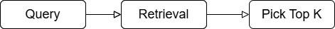
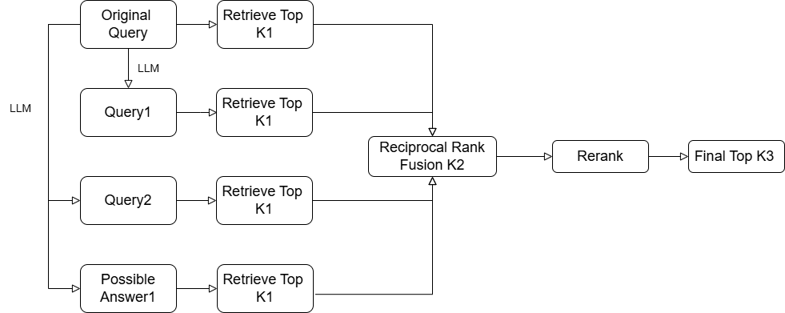
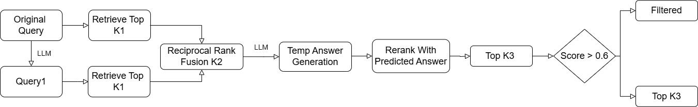

# RAG-based Academic Paper Question Answering System

---
Project: RAG-based Academic Paper Question Answering System

Author: CHOU CHIA-HSUAN

Date: 2025-04-30

Course: Generative AI

---

# 1. Data Preprocessing
### I. Section & URL Cleaning
* Remove irrelevant sections like References, Acknowledgments, Appendix, etc., to avoid retrieval noise.

* Replace all URLs with [URL] to prevent interference with chunking (due to periods in links).

### II. Chunking & Splitting
* Split each document by topic and section, then chunk the content with a max length of 500 characters and 120-character overlap, ensuring sentence completeness using . and spaces as separators.

* Fix chunks that start with punctuation for cleaner inputs.

### III. Vector Store Construction
Each chunk is stored in ChromaDB along with its title and chunk ID for retrieval.

# 2. Model Setup
I. Environment: Google Colab

II. Answering Model: **llama-3.1-8b-instant** (via Groq)

III. Query & Hypothesis Generator: Meta-Llama-3-8B-Instruct (Hugging Face)

IV. Embedding Model: BAAI/bge-base-en-v1.5 (Hugging Face)

V. Vector Database: ChromaDB (datasets hosted on Hugging Face)

VI. Reranker: BAAI/bge-reranker-large (Hugging Face, Cross Encoder)

# 3. Prompt
### I.	RAG answer prompt：
You are a helpful assistant. Use the retrieved context to answer the question accurately.

Answer a question about the following topic:

=== Topic ===

{{title}}

Use the topic to identify the most relevant information in the retrieved content.

Instructions:
- Carefully read the context and question.
- Only use the retrieved context below to answer.
- Do not add any outside information.

=== Retrieved Context ===

{{context}}

Question: {{question}}

Answer: &lt;brief answer&gt;

Think step by step before answering.

#### a.	Role Prompting：
By using "You are a helpful assistant," the prompt clearly assigns the model the role of a data assistant and emphasizes that the task is to answer the question based on the given topic and retrieved content.
#### b.	Zero shot chain of thought：
Since the retrieved context may be lengthy, the prompt guides the model to reason logically before answering by including the instruction "Think step by step before answering," encouraging thoughtful response generation.

### II.	Query Augmentation Prompt
You are a helpful assistant that expands a given research question into 2 additional diverse search queries.

These queries should cover different perspectives, subtopics, or alternative phrasings of the original question.

Return exactly 2 queries, one per line, without any explanations or numbering."

Original Question: {question}

Generate 2 related but diverse search queries:

### III.	Answer Generation Prompt
You are a knowledgeable research assistant. 

Based on the research question, hypothesize 2 possible answers (concise statements). 

Only return the 2 hypotheses, one per line, no explanations.

Question: {question}

# 4. Overview of Retrieval Methods
### I. Retrieval Method
* Retrieve relevant text chunks from a vector database based on the given topic. The user’s question is encoded using an **embedding model (e.g., BAAI/bge-base-en-v1.5)** to compute semantic similarity with all available chunks, and the top-K most similar chunks are selected.

* If the number of chunks under the specified topic is less than top_k, the custom Retrieval class performs fallback retrieval from other topics to fill in the gap. However, such fallback was not triggered during training or testing.

### II. Rerank (BGE reranker)
A **cross-encoder model (BAAI/bge-reranker-large)** is used to evaluate the semantic relevance between each retrieved document and the original query. Each query-document pair is scored, and the top-K ranked chunks are retained, or alternatively, only those with a score > 0.6.

### III. Query Augmentation
Two additional semantically related but differently phrased queries are generated using an LLM (Large Language Model) to diversify the search and increase evidence coverage.

### IV. Answer Hypothesis
Initial answers are generated using an LLM and then used as additional queries. These serve as semantic anchors to help retrieve evidence aligned with possible correct answers.

### V. Reciprocal Rank Fusion (RRF)
A ranking aggregation algorithm that combines results from multiple queries by summing reciprocal ranks. Chunks that appear across multiple queries are ranked higher, improving the prominence of important evidence in the final ranking.

### VI. Score Filter
After reranking, each chunk’s semantic similarity with the question is scored. A filter is applied to retain only those chunks with a rerank score greater than 0.6, ensuring relevance and reducing noise.

# 5. Retrieval Ways：
### I.	Query→Retrieve Top K：

### II.	Query→Retrieve→Rerank：

### III.	Query Augmentation → RRF → Rerank：

### IV.	Answer Hypothesis → RRF → Rerank：

### V.	Query Augmentation + Answer Hypothesis → RRF → Rerank

### VI.	Query Augmentation → RRF → Rerank → Score Filter

### VII.	Query Augmentation + Answer → RRF → Rerank → Score Filter

### VIII.	Query Expansion → RRF→ Temp Answer → Answer-Guided Rerank → Score Filter

# 6. Research Process and Comparison
### I.Research Process

### II.Method Comparison
| Ways                                                      | K1 | K2 | K3 | Accuracy | ROUGE-L | >0.7 | >0.5 | >0.3 |
|------------------------------------------------------------|----|----|----|----------|----------|------|------|------|
| Query → Retrieve                                           | 5  |    |    | 0.30     | 0.1749   | 0    | 0    | 17   |
| Query → Retrieve → Rerank                                 | 15 |   5  |  | 0.38     | 0.1880   | 0    | 1    | 20   |
| Query Aug → RRF → Rerank                                  | 10 | 15 | 5  | 0.36     | 0.1857   | 0    | 0    | 20   |
| Answer → RRF → Rerank                                     | 10   | 15  |  5  | 0.27     | 0.1674   | 0    | 0    | 16   |
| Query Aug + Answer → RRF → Rerank                         |  10  |  15  |   5 | 0.35     | 0.1831   | 0    | 0    | 22   |
| Query Aug → RRF → Rerank → Score Filter                   |  10  |  15  |  5  | 0.34     | 0.2043   | 3    | 4    | 22   |
| Query Aug + Answer → RRF → Rerank → Score Filter          | 10   |   15 |  5  | 0.32     | 0.2017   | 3    | 5    | 23   |
| **Query Aug → RRF → Temp Answer → Answer-Rerank → Filter**    |  10  |  15  |  5  | **0.36**   | **0.2809**   | 7    | 8    | 33   |

Final Test data performance: Accuracy0.48 /ROUGE-L 0.2990
(baseline：0.43/0.21221)