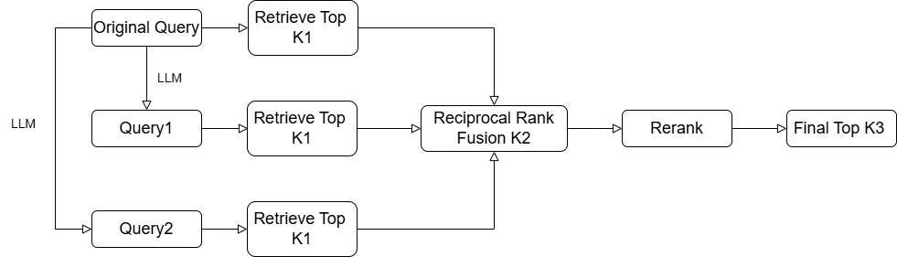
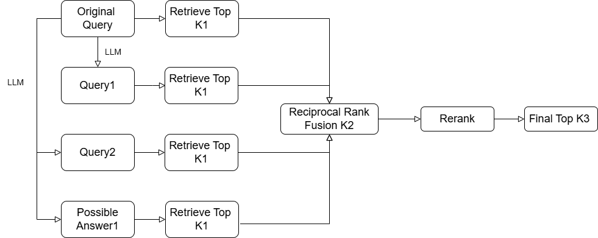
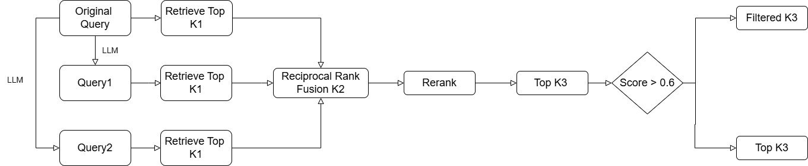
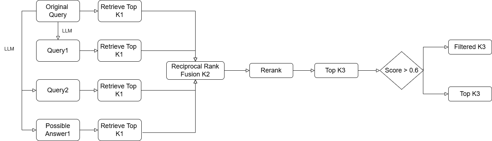
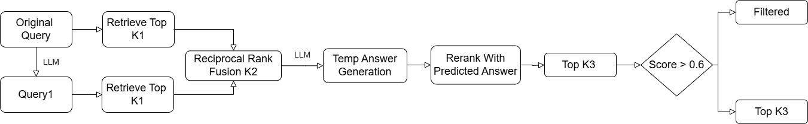
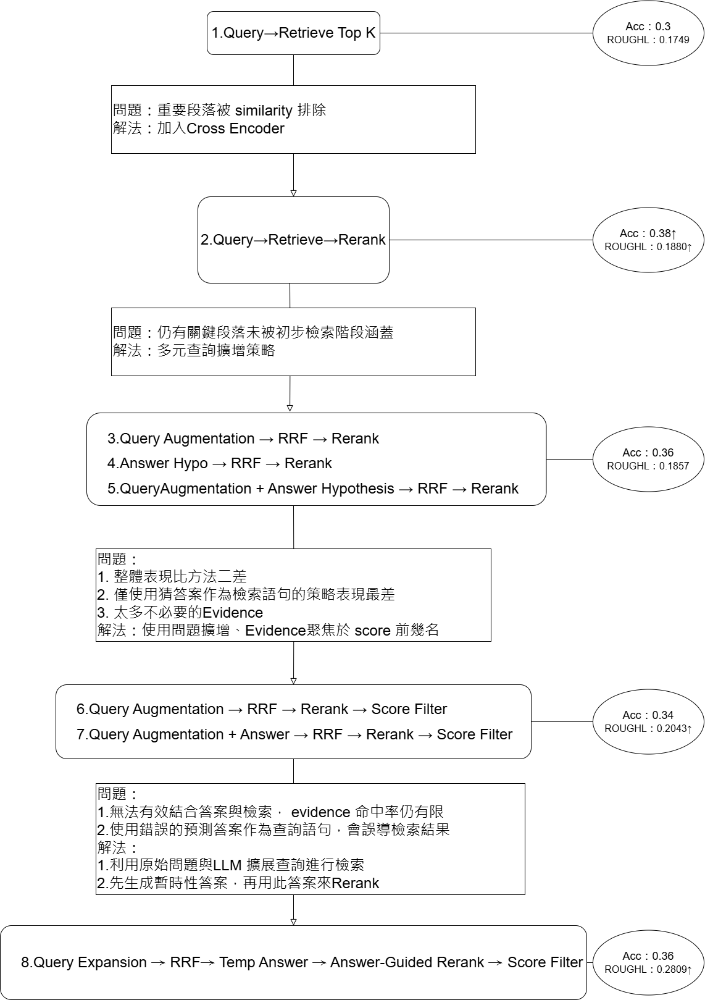

# 基於 RAG 的學術論文 QA 系統

---
Project: 基於 RAG 的學術論文 QA 系統

Author: 周佳萱

Date: 2025-04-30

Course: Generative AI

---

# 一、	資料前處理
### I.	移除特定段落、超連結：
#### 1.	移除與問答無關的段落(Section)，例如：References,  Acknowledgments, Acknowledgements, Acknowledgment, Appendix, Acknowledgement，避免干擾檢索結果。
#### 2.	避免網址中句點（.）影響 chunking 切割結果，將所有網址以 [URL] 標示取代。 

### II.	Chunking & Split：
#### 1.	將每篇全文依據 Topic 與 Section 先進行主題分段，接著以最大長度 500 字、重疊 120 字切割多個 chunk。依據 . 和空白進行斷句，保證 chunk為完整語句。
#### 2.	因為切割後會出現句點在句首的情況，所以修正Chunk句點出現在開頭的情形。
## III.	將每個 chunk 搭配對應的 title 與 chunk_id，組成 Document，並儲存至到Chroma 向量資料庫。

# 二、	模型使用
### I.	環境設定：模型開發與實驗皆在 Google Colab 上進行。
### II.	回答最終答案模型：llama-3.1-8b-instant(Groq)
### III.	問題擴充與預設答案生成的模型：meta-llama/Meta-Llama-3-8B-Instruct(Hugging Face)
### IV.	Embedding model：BAAI/bge-base-en-v1.5(Hugging Face)
### V.	向量資料庫：ChromaDB(測試資料壓縮檔存在Hugging Face上)
### VI.	Rerank model(Cross Encoder)：BAAI/bge-reranker-large(Hugging Face)

# 三、	Prompt
### I.	RAG answer prompt：
You are a helpful assistant. Use the retrieved context to answer the question accurately.

Answer a question about the following topic:
=== Topic ===
{{title}}

Use the topic to identify the most relevant information in the retrieved content.

Instructions:
- Carefully read the context and question.
- Only use the retrieved context below to answer.
- Do not add any outside information.

=== Retrieved Context ===
{{context}}

Question: {{question}}

Answer: &lt;brief answer&gt;

Think step by step before answering.

### a.	Role Prompting：
透過You are a helpful assistant，明確指定模型扮演資料助理角色，並強調任務是根據提供的主題與檢索資料回答問題。
#### b.	Zero shot chain of thought：
因為檢索內容可能較長，引導模型從檢索內容中邏輯推理後再回答，使用Think step by step before answering，提醒模型回答前要思考一下。

### II.	Query Augmentation Prompt
You are a helpful assistant that expands a given research question into 2 additional diverse search queries.
These queries should cover different perspectives, subtopics, or alternative phrasings of the original question.
Return exactly 2 queries, one per line, without any explanations or numbering."

Original Question: {question}
Generate 2 related but diverse search queries:

### III.	Answer Generation Prompt
You are a knowledgeable research assistant. 
Based on the research question, hypothesize 2 possible answers (concise statements). 
Only return the 2 hypotheses, one per line, no explanations.
Question: {question}

# 四、	檢索方法概述：
### I.	Retrieval 方法：
* 向量資料庫中提取與該主題對應的文段，以問題 question 為查詢語句，透過 embedding model（如 BAAI/bge-base-en-v1.5）對所有片段做語意向量比對，取前 top k 篇 similarity。
* Retrieval class若該主題下段落不足 top_k，則會進行補充檢索，從其他主題中補齊缺口，但在訓練、測試的過程都沒發生這件情形。

### II.	Rerank (BGE reranker)：
用 cross encoder 模型判斷每篇 retrieved document 對於 query的相關性，使用 BAAI/bge-reranker-large，逐對計算 query-document 的 matching score，保留 top K，或只取 score > 0.6 。
### III.	Query Augmentation：
透過 LLM生成 2 條與原始問題不同但相關的搜尋語句。
### IV.	Answer Hypothesis：
透過 LLM生成初步回答，用這個回答作為另一個檢索向量，幫助找出與可能回答相符的段落。
### V.	Reciprocal Rank Fusion(RRF)：
融合多個檢索結果的排序演算法，對於每個查詢結果的 rank 分數進行加總，讓多個查詢中都有的相同文件排名更前面，提升重要文件在最終排序中的排名。
### VI.	Score filter：
完成 Rerank後，我們會對每一段檢索到的文本與問題之間的語意相似度進行配對打分，設定只要 Rerank score 大於 0.6。

# 五、	檢索方法流程圖：
### I.	Query→Retrieve Top K：

### II.	Query→Retrieve→Rerank：

### III.	Query Augmentation → RRF → Rerank：

### IV.	Answer Hypothesis → RRF → Rerank：

### V.	Query Augmentation + Answer Hypothesis → RRF → Rerank

### VI.	Query Augmentation → RRF → Rerank → Score Filter

### VII.	Query Augmentation + Answer → RRF → Rerank → Score Filter

### VIII.	Query Expansion → RRF→ Temp Answer → Answer-Guided Rerank → Score Filter

# 六、	研究過程以及方法比較
### I.研究過程

### II.不同方法比較

| 方 法                                                       | K1 | K2 | K3 | Accuracy | ROUGE-L | >0.7 | >0.5 | >0.3 |
|------------------------------------------------------------|----|----|----|----------|----------|------|------|------|
| Query → Retrieve                                           | 5  |    |    | 0.30     | 0.1749   | 0    | 0    | 17   |
| Query → Retrieve → Rerank                                 | 15 |   5  |  | 0.38     | 0.1880   | 0    | 1    | 20   |
| Query Aug → RRF → Rerank                                  | 10 | 15 | 5  | 0.36     | 0.1857   | 0    | 0    | 20   |
| Answer → RRF → Rerank                                     | 10   | 15  |  5  | 0.27     | 0.1674   | 0    | 0    | 16   |
| Query Aug + Answer → RRF → Rerank                         |  10  |  15  |   5 | 0.35     | 0.1831   | 0    | 0    | 22   |
| Query Aug → RRF → Rerank → Score Filter                   |  10  |  15  |  5  | 0.34     | 0.2043   | 3    | 4    | 22   |
| Query Aug + Answer → RRF → Rerank → Score Filter          | 10   |   15 |  5  | 0.32     | 0.2017   | 3    | 5    | 23   |
| Query Aug → RRF → Temp Answer → Answer-Rerank → Filter    |  10  |  15  |  5  | 0.36     | 0.2809   | 7    | 8    | 33   |

### III.文字敘述
#### I.	方法一：Query → Retrieve Top K
我直接以問題作為查詢語句，從向量資料庫中取出語意相似度最高的前 K 筆段落。當檢索8個時，準確度為36%，ROUGHL是0.1387，當檢索量降為5時，準確度降為30%，ROUGHL卻升到0.1749。這指出一個問題：部分正確的 evidence 雖然在語意上與問題相符，但在 embedding similarity 排序中被排到後面，導致無法被取到。

#### II.	方法二 Query→Retrieve→Rerank
為了改善這一問題，我加入Cross Encoder。將第一階段向量檢索的結果，再交給 Cross Encoder 模型（BAAI/bge-reranker-large）根據 query–evidence 配對做語意比對排序。不同於方法一的分開編碼 query 和 document，Cross Encoder 將整段文本與 query 一起編碼，可更準確比對語句之間的邏輯與上下文關聯。在檢索為5的情況下，準確率提升到38%、 ROUGE-L 提升到0.1880，顯示 rerank 有效提升了 evidence 排序的品質。但仍與 baseline 有些落差，表示仍有部分關鍵段落未被初步檢索階段涵蓋。

#### III.	方法三～五：引入多元查詢策略（Query/Answer Augmentation）
為了解決方法二中仍無法涵蓋所有關鍵證據的問題，我進一步設計了多元查詢擴增策略，希望能提升 evidence 覆蓋率與回答準確率。

因此我實驗以下三種方法：
* 方法三：Query Augmentation → RRF → Rerank
使用 LLM 將原始問題擴充為兩個不同角度的相關查詢語句，和原始問題分別檢索後進行 RRF 再 rerank。
* 方法四：Answer Hypothesis → RRF → Rerank
讓模型根據問題產出兩個可能答案，用這些假設答案和原始問題進行檢索，再經 RRF 再rerank。
* 方法五：Query Augmentation + Answer Hypothesis → RRF → Rerank
    同時使用擴增的 query 與預測答案作為檢索語句，綜合所有結果後排序取  證據。

每個方法都使用原始 query 與擴增語句（或答案）各檢索 10 筆段落，經 RRF 排名取前 15，再用 Cross Encoder rerank 選前 5 作為 evidence。根據表一，準確率分別為0.36/0.27/0.35，ROUGHL分別為0.1857/0.1674/0.1831，這三種策略的表現並未明顯優於方法二。

我想根據回答來探討表現沒比較好的原因：
* 問題：How large is their MNER SnapCaptions dataset?
* 正確答案： 10K user-generated image (snap) and textual caption pairs
* 正確證據：The SnapCaptions dataset is composed of 10K user-generated image (snap) and textual caption pairs where named entities in captions are manually labeled by expert human annotators (entity types: PER, LOC, ORG, MISC).
 
在模型最終選出的五個證據中可以觀察到，前兩個 chunk 的分數明顯高於其他段落，且第一個 chunk 就是正確證據所在。這顯示出關鍵證據往往集中在 rerank 分數排名前段的位置，而後面段落的品質與相關性則迅速下降。因此，若能進一步聚焦於分數最高的前幾個段落，有機會進一步提升整體的檢索與回答品質。

此外，從整體結果來看，僅使用猜答案（方法四）作為檢索語句的策略表現最差。因此，我將不再採用僅猜測答案檢索資料來源，而是專注在 query 擴增或 rerank 的優化上。

#### IV.	方法六、七：加入 Score Filter 精煉檢索結果
在嘗試方法六Query Augmentation → RRF → Rerank → Score Filter、方法七 Query Augmentation + Answer → RRF → Rerank → Score Filter，雖然在相同參數設定下加入 score > 0.6 的篩選條件後，準確度分別為 0.32 與 0.34，與 baseline 差距不大，但 ROUGE-L 分數略有提升，分別達到 0.2017 與 0.2043，顯示這兩種方法在內容擷取上有些微改善，但還是跟baseline有點差距，因此我進一步分析了使用僅使用問題擴增與問題擴增+預測答案查詢之間的差異。

* 問題：Which datasets are used?
* 正確答案：
 (1) A corpus of 740 classical and contemporary English poems",
 (2) a corpus of 14950 metaphor sentences retrieved from a metaphor database website"
 (3) a corpus of 1500 song lyrics ranging across genres",
Gutenberg dataset BIBREF24"

* 正確證據：
We use three creative English datasets with distinct linguistic characteristics: (1) A corpus of 740 classical and contemporary English poems, (2) a corpus of 14950 metaphor sentences retrieved from a metaphor database website and (3) a corpus of 1500 song lyrics ranging across genres.
We first pre-train our generator on the Gutenberg dataset BIBREF24 for 20 epochs and then fine-tune BIBREF19 them to our target datasets with a language modeling objective."

* 比較：

| 項目                     | Query Augmentation*2 → RRF → Rerank → Score Filter | Query Augmentation*2 + Answer*2 → RRF → Rerank → Score Filter |
|--------------------------|-----------------------------------------------------|------------------------------------------------------------------|
| **Query Aug**           | Q1: What are the most commonly used datasets in machine learning research?    Q2: What datasets are most relevant to a specific industry or domain, such as healthcare or finance? | 同左欄 |
| **Answer Generation**   | -                                                   | A1: IMDB movie reviews   A2: Newsgroups                        |
| **模型答案**            | Same as correct answer                              | No relevant documents                                             |
| **模型證據**            | #1 \| Score: 0.9997   Preview: We use three creative English datasets with distinct linguistic characteristics: (1) A corpus of 740 classical and contemporary English poems, (2) a corpus of 14950 metaphor sentences retrieved from a... | #1 \| Score: 0.7547   Preview: Language models can be optimized to recognize syntax and semantics with great accuracy BIBREF0. However, the output generated can be repetitive and generic leading to monotonous or uninteresting responses (e.g “I don't know”) ... |

從上述結果可明確觀察到，若加入錯誤答案作為檢索資料來源，雖然形式上是提供更多語意資訊，實際上卻會嚴重誤導 retriever。像是 IMDB movie reviews 和 Newsgroups 雖然是常見的機器學習資料集，但與該論文中的詩詞、譬喻、歌詞等創作性文本資料集毫無關聯，因此檢索與 rerank 都被導向錯誤方向，進而降低了最終答案的準確率與相關性。

相較之下，若採用問題擴增的方式，以原始問題為基礎，從原始問題出發透過 LLM 產生多樣的相關查詢語句，可有效提升檢索覆蓋率與 evidence 命中率，
整體表現也顯著優於使用預測答案進行擴增的方式。

#### V.	方法八：Query Expansion → RRF→ Temp Answer → Answer-Guided Rerank → Score Filter：
在方法八中，我們使用原始問題與其擴增版本的查詢語句進行檢索，並透過 Reciprocal Rank Fusion融合不同查詢所獲得的檢索結果。接著，透過模型生成一個暫時性的預測答案，並以此答案作為語義指引，對先前融合後的檢索內容進行重新排序，最後篩選出 rerank 分數高於 0.6 的段落作為最終證據。

這樣的設計不僅能藉由查詢語句的多樣性擴大檢索覆蓋範圍，更能利用預測答案強化語意比對，使得與答案高度相關的段落更容易被正確辨識與選取，進一步提升證據的準確性。

準確率雖然只有提高到0.36，但evidence的ROUGH-L大幅提升到0.2809。應用在測試集的結果也有不錯的表現，達到 0.48 的準確率與 0.2990 的 ROUGE-L，顯示方法八在提升 evidence 相關性上具顯著效果。

#### VI.	最終答案提交模型選取：
嘗試三次前測結果：
|方法|回答最終答案模型|	準確度	|ROUGH-L|
|-----|--------------|---------|--------|
|方法三：Query Augmentation → RRF → Rerank|	llama-3.3-70b-versatile	|0.38|	0.2071|
|方法八：Query Expansion → RRF→ Temp Answer → Answer-Guided Rerank → Score Filter	|llama-3.3-70b-versatile	|0.48	|0.2990
|方法八：Query Expansion → RRF→ Temp Answer → Answer-Guided Rerank → Score Filter	|llama-3.1-8b-instant|0.48	|0.2990

不同模型解答差異：
1.	證據沒有提供答案：

問題：What is the size of this dataset?

證據：

"We introduce a new crowdsourced dataset of 23,700 queries, including 22,500 in-scope queries covering 150 intents, which can be grouped into 10 general domains. The dataset also includes 1,200 out-of-scope queries. Table TABREF2 shows examples of the data.",
"Moreover, most if not all queries in these datasets are in-scope. In contrast, the focus of our analysis is on both in- and out-of-scope queries that challenge a virtual assistant to determine whether it can provide an acceptable response.",
"The queries cover 150 intents, plus out-of-scope queries that do not fall within any of the 150 in-scope intents. We evaluate a range of benchmark classifiers and out-of-scope handling methods on our dataset. BERT BIBREF1 yields the best in-scope accuracy, scoring 96% or above even when we limit the training data or introduce class imbalance. However, all methods struggle with identifying out-of-scope queries."
|	|llama-3.3-70b-versatile	|llama-3.1-8b-instant|
|---|---------------------------|--------------------|
|答案|	23,700 queries	|“”|
|行為|	仍會從證據中嘗試擷取內容回答|	直接空字串(錯的)|

2.	證據有提供答案：

問題：what algorithms did they use?

證據(第三個)：

"We implement three types of tag recommendation approaches, i.e., (i) popularity-based, (ii) similarity-based (i.e., using content information), and (iii) hybrid approaches. Due to the lack of personalized tags (i.e., we do not know which user has assigned a tag), we do not implement other types of algorithms such as collaborative filtering BIBREF8 . In total, we evaluate 19 different algorithms to recommend tags for annotating e-books.  Popularity-based approaches.",
|	|llama-3.3-70b-versatile	|llama-3.1-8b-instant|
|---|---------------------------|--------------------|
|答案	|They used 19 different algorithms, including (i) popularity-based, (ii) similarity-based, and (iii) hybrid approaches, but did not use collaborative filtering due to lack of personalized tags.	|They used three types of tag recommendation approaches: (i) popularity-based, (ii) similarity-based, and (iii) hybrid approaches.|
|行為	|回答正確，且補充了額外細節（數量與未使用原因）|	回答正確，但僅提及必要資訊，較為簡潔|

原先預期 70B 模型能在一樣證據條件下表現更好，但實驗發現兩者在回答正確率上相同。進一步觀察可知：

* 當證據不足時，70B 模型會積極從文本推測出可能答案，8B 模型則傾向空白不回答。
* 當證據充足時，70B 模型除了回答問題外，還會補充更多 contextual information，而8B 模型則傾向只回答問題本身。

推測原因可能是因為本次實驗中證據都經過整理且十分精煉(檢索數量小於5且取score大於0.6)，檢索文本本身已涵蓋主要答案，因此即使模型規模不同，表現差異也被拉小。

**這也顯示在 RAG中，只要檢索到的證據足夠精確、內容充足，即便使用較小的模型也能達到接近大型模型的效果。**
